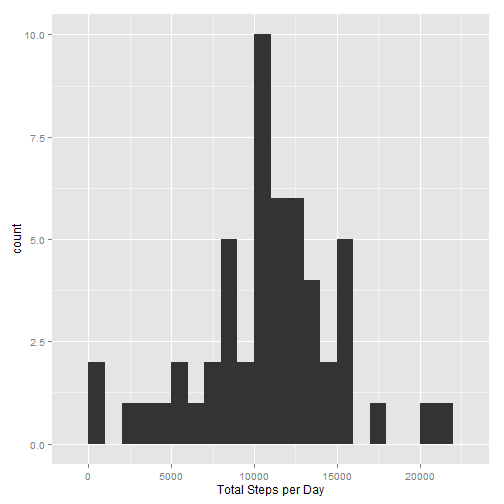
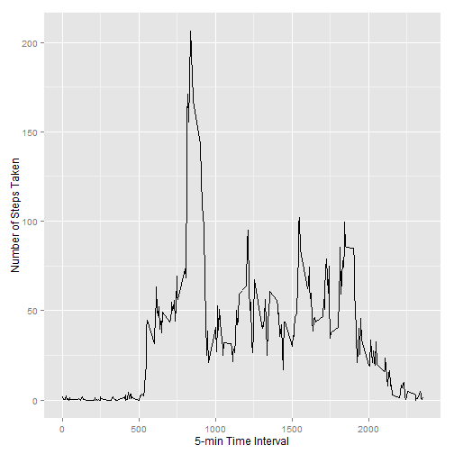
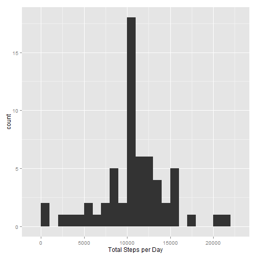

# Reproducible Research Data Project 1


  
## Check and load packages

```{r, echo = TRUE}
if (!require("plyr")) {
  install.packages("plyr")
}
library(plyr)

if (!require("ggplot2")) {
  install.packages("ggplot2")
}
library(ggplot2)
```
##Download and extract data
```{r, echo = FALSE}
#setwd("C:/Users/Christian/Dropbox/Christian Hubbs/MOOC/Repeatable Data")
#fileURL <- "https://d396qusza40orc.cloudfront.net/repdata%2Fdata%2Factivity.zip"
#download.file(fileURL, destfile = "C:/Users/Christian/Dropbox/Christian Hubbs/MOOC/Repeatable Data/repdata-data-activity.zip")
#Unzip and Extract Data
move_data <- read.csv(unz("C:/Users/Christian/Dropbox/Christian Hubbs/MOOC/Repeatable Data/repdata-data-activity.zip", "activity.csv"), header = T)
data <- na.omit(move_data)
```
###What is the mean number of steps taken per day?

```{r, echo = TRUE}
#Provide Histogram, calculate mean and median
data$POSDate <- as.POSIXct(data$date)
tot_steps <- aggregate(data$steps, FUN = sum, by = list(data$POSDate), na.rm = TRUE)
mean_steps <- mean(tot_steps$x, na.rm = TRUE)
print("Mean Daily Steps")
print(mean_steps)
median_steps <- median(tot_steps$x, na.rm = TRUE)
print("Median Daily Steps")
print(median_steps)
qplot(tot_steps$x, binwidth = 1000, xlab = "Total Steps per Day")
```
 
###What is the average daily activity pattern?
```{r}
i_a <- aggregate(data$steps, FUN = mean, by = list(data$interval), na.rm = TRUE)
colnames(i_a) <- c("Interval", "AvgSteps")
qplot(Interval, AvgSteps, data = i_a, geom = "line", 
      xlab = "5-min Time Interval", ylab = "Number of Steps Taken")
max_int <- i_a$Interval[which(i_a$AvgSteps == max(i_a$AvgSteps))]
print("Interval with highest activity:")
print(max_int)

```
 
###Impute the missing values into the data set. 
1. Determine and report the number of steps missing from the data. 
```{r}
mis_steps <- is.na(move_data$steps)
table(mis_steps)
```
2. Devise a strategy and fill in the missing data.
```{r}
complete <- move_data
filled <- 1:length(move_data$steps)
for (i in length(filled)) {
  if (!is.na(move_data$steps[i])) 
    filled <- c(move_data$steps[i])
      else filled <- (i_a[i_a$Interval == move_data$interval, "AvgSteps"])
}
complete$steps[is.na(complete$steps)] <- filled[!is.na(filled)]

```
3. Create a new histogram with the completed data set.
```{r}
tot_steps2 <- aggregate(complete$steps, FUN = sum, by = list(complete$date), na.rm = TRUE)
mean_steps2 <- mean(tot_steps2$x, na.rm = TRUE)
print("Mean Daily Steps")
print(mean_steps2)
median_steps2 <- median(tot_steps2$x, na.rm = TRUE)
print("Median Daily Steps")
print(median_steps2)
qplot(tot_steps2$x, binwidth = 1000, xlab = "Total Steps per Day")
```
 
###Are there differences in activity levels between weekdays and weekends
```{r}
complete$date <- as.POSIXct(complete$date)
day.sep <- function(date) {
  day <- weekdays(date)
  if (day %in% c("Montag", "Dienstag", "Mittwoch", "Donnerstag", "Freitag")) 
    return("weekday") else if (day %in% c("Samstag", "Sonntag")) 
      return("weekend") else stop(NA)
}
complete$day <- sapply(complete$date, FUN = day.sep)

averages <- aggregate(steps ~ interval + day, data = complete, mean)
ggplot(averages, aes(interval, steps)) + geom_line() + facet_grid(day ~ .) + 
  xlab("5-minute interval") + ylab("Number of steps")
```
 

